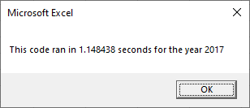
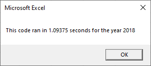
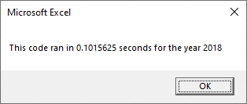

## Stock Analysis

## Project Overview

### Purpose
The following analysis was performed to compare the annual perfomace of a select amount of green energy stocks. The following analysis was performed using VBA
improve the efficiency and perfomance of VBA code used to analze stock data.

### Results

##### Stock Perforamce
201
1. **2017 Results**

   a) **Original Code**
   

   
   

   
   b) **Refactored Code**
   

   
   

   
2. **2018 Results**
   
   a) **Original Code**
   

   
   

   
   b) **Refactored Code**
   

   
   

### Summary

1. Advantages of refactoring code
- Allows the code to process larger amounts of data in faster processing rate
- Improves the code design to simplify additions and extensions to the code
- Improves code run time efficiency 

2. Disadvantages of refactoring code
- Understanding and interpreting original code as well as writing new code can be time consuming.
- New code may 

  
2. How do these pros and cons apply to refactoring the original VBA script?(3pt)
